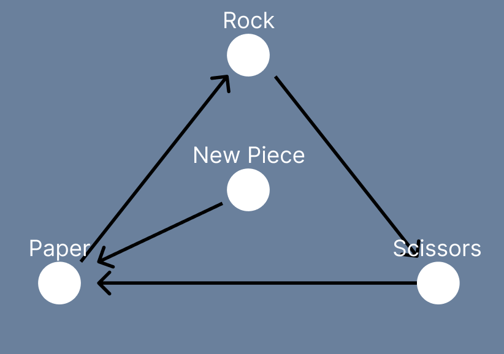

# Rust-Paper-Scissors

A simple game of rock, paper, scissors implemented in Rust.

## Technicalities

I had to learn match expressions and implementing the Display trait for the first time. I also had to learn how to use the rand crate. Not a hard project by any means, but it was a start on my Rust journey.

The game allows for new hands to be added without much effort. This was done with the use of 'strum' and 'strum_macros' crates. If you want to add new hands:

- Go to the [hands.rs](src/hands.rs) file.
- In the Hands enum, add your desired hand (You will
  also need to add a serialize macro to the variant. See the other variants for examples).
- You will also need to edit the beats() function to add the new hand. (See the other variants for examples).

## Insufficiencies

One problem of this code is that a hand can win against one and only one other piece. This means that when you add additional hands to the game, the game immediately becomes unfair. The newly added hand isn't beaten by any other hand, making it the optimal choice for the player from that point.

For example:

 The original rock-paper-scissors looks like the above. Every hand has exactly one hand they lose and win against. When we add a hand to the game without proper care of win and lose conditions, the game may turn into something like this:
 As you can see, there are no hands that win against the New Piece. This means the game is not 'fair' anymore.

I may solve this insufficiency in later versions of this code but for now, the unfairness will stay.
